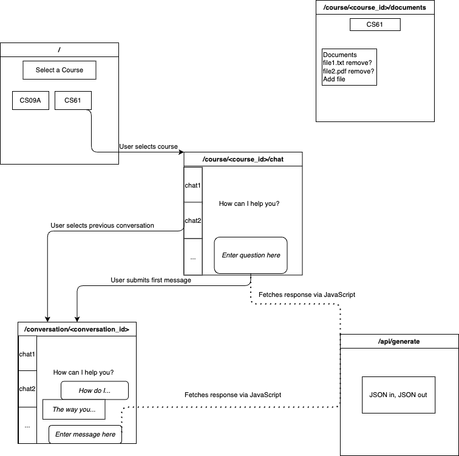

**State:** Functional backend API.

**Objective**: Create an MVP supporting upload of course documents and
chats for a course

**Due Date**: Wednesday, July 16th

**Future**: User authentication, refined web UI, chat summary reporting,
assistant messages

**Introduction**

In our first sprint, we completed the core components of our backend
API: document parsing, the database, and the language and embedding
models. This sprint, we shall leverage these components to create a
Minimum Viable Product (MVP). An MVP is a version of our final
application that will contain the necessary features for basic
interaction. The idea is that, by creating something that we can see and
test early, we better shall be able to detect errors early and to make
design decisions.

The sprint is split into two features that need to be added: document
uploading and a chatroom with the RAG-powered LLM. The features are both
to be implemented as web endpoints. Therefore, everyone should read the
[[Project
Layout]{.underline}](https://flask.palletsprojects.com/en/stable/tutorial/layout/)
tutorial for Flask, on which our project's structure is based. Read
through the entire tutorial by accessing subsequent web pages with the
"continue" button at the bottom of each page.

Note: We are **NOT** dealing with authentication (unless the stretch is
reached) this sprint.

Note: All styling should use [[Tailwind
CSS]{.underline}](https://tailwindcss.com/) because that seems to be
what the current ULA website uses.

The following diagram shows how our endpoints should interact at a high
level.

{width="4.020833333333333in"
height="4.020833333333333in"}

**Document Uploading --- Student #2, Student #5, Student #3**

**Objective:** Write code for a web endpoint for uploading files for a
course

You must fill out the
[[course_documents]{.underline}](https://github.com/joshua-zingale/ucr-chatbot-pathway-program/blob/78739a58544a2d08408b1cab8158f8360c1a9f6b/ucr_chatbot/web_interface/routes.py#L42)
route skeleton code to create a web endpoint where a course
administrator can manage the documents for a course with a specific ID.
All of the functionality that you will be adding will be at this
endpoint.

The pipeline should work as follows:

1.  Administrator uploads a new document for the course

2.  The document is parsed into text and split into segments

3.  Embeddings are generated for each segment.

4.  The database is populated with the document, segments, and
    embeddings

There should also be the ability to remove a document. If a document is
removed, somehow mark it in the database as not to be searched when
pulling context for RAG; but do not remove the database entries for it
because this would lead to the logged information about sources
referenced by the language model being uninterpretable.

You will want to add a template into
[*[templates/]{.underline}*](https://github.com/joshua-zingale/ucr-chatbot-pathway-program/tree/78739a58544a2d08408b1cab8158f8360c1a9f6b/ucr_chatbot/templates)
containing HTML for the front-end display. You also may want to add a
Javascript static file depending on how you implement the front end.

Note that the actual files should ***NOT*** be stored in the database.
These should be stored as plain files. Follow the instructions
[[here]{.underline}](https://flask.palletsprojects.com/en/stable/patterns/fileuploads/)
for supporting file uploads with flask. Please pay special attention to
the safety concerns. (We do not want a file upload to break our server.)
Make the upload storage location easily configurable because we may
switch to storage in Google's ecosystem later. For now, local storage is
fine, with one folder per course. The Documents table should only store
a pointer to the file. The Segments table should, however, contain
actual text from files.

**(Stretch Goal) Authentication --- Student #2, Student #5, Student #3**

**Objective:** Write code for basic user authentication to gate access
by privilege

Add user authentication with the following rules:

-   A user must be authenticated to have access to any of the features
    on the website.

-   Only a user who is an administrator (e.g. instructor) for a course
    should be able to add documents

Ultimately, we shall want to use [[Google\'s
OAuth]{.underline}](https://realpython.com/flask-google-login/) to
authenticate users. For now, it would suffice for you to write code for
a login flow and a script (that we can run on our end) that reads a CSV
file of emails and then creates Users along with passwords for each user
listed in the CSV. We hence could email each student his credentials to
access the system.

[[Flask-Login]{.underline}](https://flask-login.readthedocs.io/en/latest/)
looks promising as a session management library. There may be a better
option which, if found, you should feel free to use instead.

If a user is not authenticated (signed in), going to a page requiring
authentication should redirect the user to a login page, after which he
should be redirected back to the page he was trying to access. If an
authenticated user tries to access a page that he does not have
permission to view (say a student who is not enrolled in a class trying
to access the chat for that class or an instructor trying to modify
documents for a course he is not teaching), he should either be
redirected or shown an invalid permissions message as appropriate.

Importantly, the LLM API must require authenticated access, lest people
use our endpoint for free Gemini credits.

**Chatroom --- Student #6, Student #4, Student #1**

**Objective:** Write code for a web endpoint for chatting with the
RAG-powered LLM

You must fill in the
[[skeleton_code]{.underline}](https://github.com/joshua-zingale/ucr-chatbot-pathway-program/blob/78739a58544a2d08408b1cab8158f8360c1a9f6b/ucr_chatbot/web_interface/routes.py#L12)
for *course_selection*, *new_conversation*, and *conversation* to enable
the following flow:

1.  A user gets to the landing page, which is routed to
    *course_selection*.

2.  After selecting a course, the user is routed to *new_conversation*
    with the ID of the course for which a new conversation should be
    started. This page should have a chat interface like Gemini or
    ChatGPT.

3.  If the user sends a message, the user should be redirected to the
    url for the *conversation* route with a newly created conversation,
    where the user's message is the only message (until the language
    model responds).

4.  The user can stay on the same webpage from here while sending and
    receiving messages.

Additionally, at any stage, the user should be able to select a
previously started conversation of his by selecting it from a side menu.

You will want to add one template (or more) into
[*[templates/]{.underline}*](https://github.com/joshua-zingale/ucr-chatbot-pathway-program/tree/78739a58544a2d08408b1cab8158f8360c1a9f6b/ucr_chatbot/templates)
containing HTML for the front-end display. You will need to add a
Javascript static file to handle communication with the generation API
endpoint. You will probably want to use
[[fetch]{.underline}](https://developer.mozilla.org/en-US/docs/Web/API/Fetch_API/Using_Fetch)
in Javascript to handle communication with the generation API.

Since we now have an actual database API, you must update
[[Retriever]{.underline}](https://github.com/joshua-zingale/ucr-chatbot-pathway-program/blob/78739a58544a2d08408b1cab8158f8360c1a9f6b/ucr_chatbot/api/context_retrieval/retriever.py)
to pull segments from the actual database instead of from the dummy
[[Document/Segment]{.underline}](https://github.com/joshua-zingale/ucr-chatbot-pathway-program/blob/78739a58544a2d08408b1cab8158f8360c1a9f6b/ucr_chatbot/api/context_retrieval/document.py)
classes, which should be removed.
