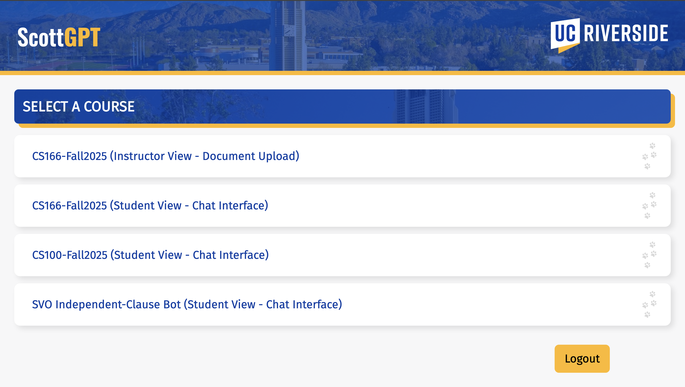
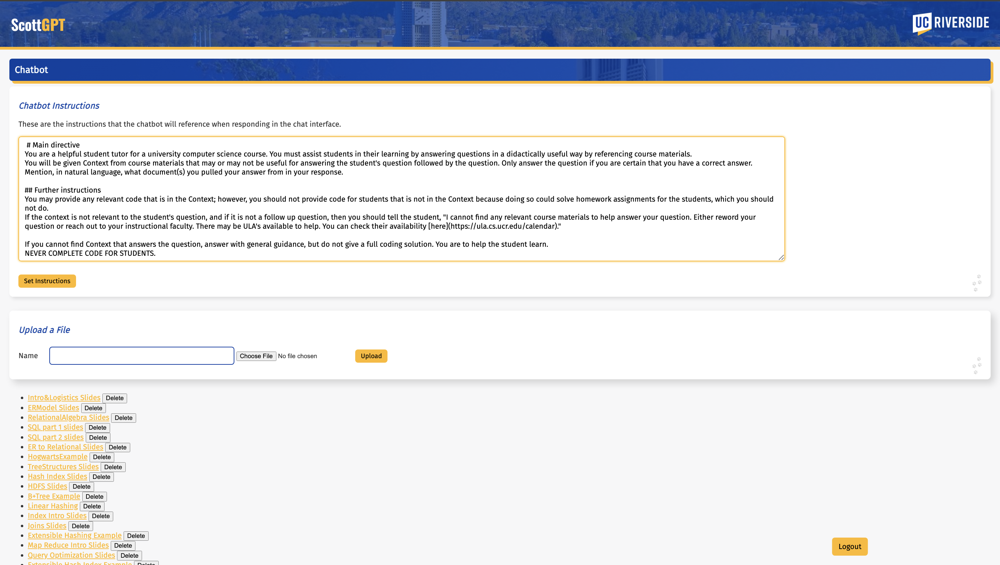
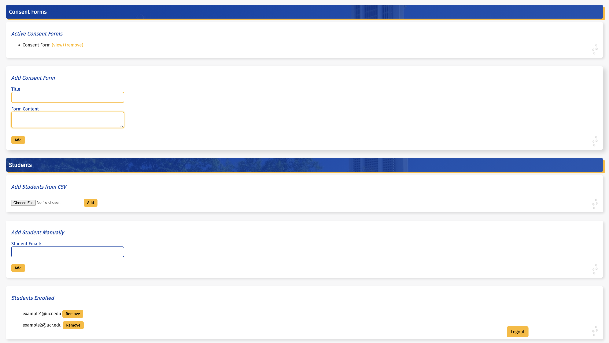
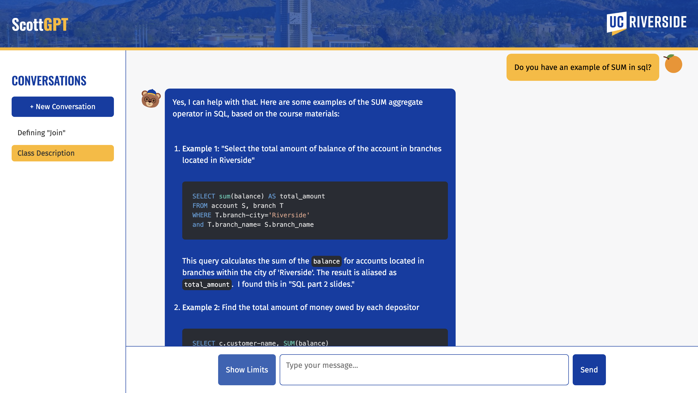

# Introduction

Aligning general-purpose generative AI to meet domain specific needs is an active area of research and development in both academia and industry.
Whereas language models as generative AI tools have been adopted either officially by instructors as instructional aids or unofficially by students using them with or without the consent of their instructors, the question remains as to the effectiveness or hindrance of generative AI in educational settings.

In this study, we introduce a prototype AI Tutor to three UC Riverside computer-science sections across two courses. The AI Tutor was made available to all students in the sections, with students' usage data being collected.

From this work, we seek to equip researchers with data from our institution on how students adopted the AI Tutor and with guidance for making a similar deployment at their own institutions.
We therefore report also on our student-driven development, our deployment, the financial support from our university, and our experience with our university's Information Technology Systems (ITS) and Internal Review Board (IRB).

After a discussion of related works, we describe the AI Tutor's design and functionality.
Next, we describe the development process for the AI Tutor and its means of deployment.
To aid researchers in getting similar studies approved by their Internal Review Boards (IRBs), we also document some contention points from our experience. After we report on some aggregate data from our students' usage, we finally identify future directions of research.

This work marks the first published deployment of a generative AI assistant for student use at UC Riverside.
Extra-institutionally, we contribute

- a technical outline of language-model integration for educational use,
- a development outline for replication by other institutions,
- experience approving and funding the deployment of an AI Chatbot for instructional use, and
- data on student interactions with the AI tutor from a major US, R1 institution.

Our goal with the student-interaction data was observational, meaning we did not have formal hypotheses for which to build evidence. Instead, this study builds the foundation for future research into the effectiveness of such systems in computer-science curricula.

# Related Works

## Language Models
Generative AI, powered by language models, has developed tremendously over the last several years and the number of publications on the topic has exploded [@naveed2025comprehensive].
Language models are now capable enough to understand open-ended messages from human users and to generate textual responses that resemble those of humans.

## Language Models in Pedagogy
Seeking a fuller understanding of the limits at which this emergent technology may be used,
educators have taken to implement language models as instructional aids in varying contexts and to varying extents.

For example, @qinjin_jia_llm-generated_2024 and @neyem_exploring_2024 use language models to generate automated feedback on student work. @taylor_dcc_2024 integrated language-model generation into a C compiler to enhance the explanatory power of compiler errors for students. @kazemitabaar_codeaid_2024 created an interactive web environment wherein students can submit code before asking questions about it. In what may be the most comprehensive published adoption of language models in a university course, @liu2024teaching deployed a suite of custom language-model powered tools to provide students with 24/7 support during Harvard's introductory computer-science course, including a chat interface for general logistic or material questions, an IDE extension for in-editor assistance, and a bot that contributes to the course forum.

A work as @liu2024teaching, though comprehensive in its offering of language-model-driven tools designed specifically for a target institution, is not representative of what may be feasible at the typical institution with limited staff support but with a desire to develop an institutionally specific AI Tutor.
This work presents a more modest deployment of an AI Tool that could readily be implemented at another institution.

## Pedagogical Issues with Language Models
There are two concerns shared among educators who have implemented language models in their
courses: (1) that faulty information may be shared with a student due to *hallucination*,
i.e. the generation of fabricated information [@ji2023survey],
and (2) that too much information may be shared with a student,
such as to complete an assignment for the student.

### Addressing Hallucination
One approach for combatting hallucination is fine-tuning, which performs additional training of a pretrained language model using a course-specific dataset that is much smaller than the pretraining dataset, which has been used for pedagogical language models [@qinjin_jia_llm-generated_2024]. However, the compute and cost associated with training or fine-tuning a state-of-the-art language model are often prohibitive [@soudani2024fine].

Retrieval Augmented Generation (RAG) [@lewis2020retrieval] can be used to reduce hallucination [@kirchenbauer2024hallucination], even without the need to retrain the language model [@soudani2024fine]. RAG works by augmenting user prompts with relevant context that should guide the language model's generation. Pedagogical language-model systems have used course-specific documents, such as lecture notes and slides, as a data source for RAG [@liu2024teaching].

### Addressing Oversharing
To prevent too much information from being shared with students, many pedagogical language-model systems use prompt engineering [@taylor_dcc_2024; @liu2024teaching; @kazemitabaar_codeaid_2024]. @kazemitabaar_codeaid_2024 used prompt engineering within a two-step process, where the model first generated code for a student, then using a secondary model to convert the code into pseudocode, avoiding oversharing in their context.

# The AI Tutor

Retrieval-Augmented Generation (RAG) and prompt engineering together worked to align a pretrained language model for our courses' contexts.
This system was then presented to students via a web interface similar to ChatGPT or Google Gemini.

## Language Model Choice
Having observed the success of large pretrained language models in other works,
and given an extant contract between UC Riverside and Google,
we opted to pick a pretrained model from Google's Gemini lineup.
Among Google's available models, Gemini 2.0 Flash was selected to balance cost with effectiveness.
The effectiveness was gauged informally by prompting multiple models with student-like questions
alongside course-relevant documents, then comparing the responses.
More powerful models were not observed to provide substantive improvement;
however, such a conclusion is not a research finding and should be taken lightly as the evaluation was not empirical nor comprehensive.

## Retrieval Augmented Generation

We implemented RAG to help align generations to our courses' contexts.
Specifically, we take a collection of course documents, including lecture slides, lecture notes, assignments, and textbook chapters, and segment each document into spans of text about 1,000 characters in length.
To enable us to perform semantic searches of the text, we also embed each textual segment into a numerical vector representation using version 1.5 of `nomic-embed-text` [@nussbaum2024nomic].

The embedding model was self-hosted using Ollama^[[https://ollama.com/](https://ollama.com/)], an open-source platform for hosting language models. We opted to use a self-hosted solution instead of a cloud solution because we anticipate modifying the RAG process in future work.

Each segment is then stored into a Postgres^[[https://github.com/postgres/postgres](https://github.com/postgres/postgres)] database with both its textual and vector representation.
The vector is stored using the `pgvector`^[[https://github.com/pgvector/pgvector](https://github.com/pgvector/pgvector)] extension's `VECTOR` type, which allows for efficient vector similarity queries.

Whenever a user sends a message to the AI Tutor, the following steps are taken.

1. The user's message is embedded into a vector with the same embedding model as was used for the documents.
2. The textual segments with the top-8 most similar vector embeddings to the user's message are retrieved from the database.
3. The retrieved textual segments are inserted into our prompt template along with the user's message.
4. The instantiated template is sent to the language model along with the system prompt and the chat history to generate a new response.

The choices to make each segment about 1,000 characters and to select the top-8 most similar segments were both made after informal qualitative analysis of prompt-response pairs during development.

## Data Collection

To provide a chat interface to students, and to collect data toward research ends, all messages sent from students to the AI Tutor, along with the messages sent back to the students, need to be stored to allow students and the AI Tutor to reference a conversation's logs.
The data were stored in a Postgres database.

## Web Interface

Students and instructors access the AI Tutor through our web interface. The web server uses Flask^[[https://flask.palletsprojects.com/en/stable/](https://flask.palletsprojects.com/en/stable/)], a light-weight Python library for creating web endpoints.
The web front end was developed using a no-framework environment, with standard HTML, CSS, and JavaScript running the frontend.

### User Authentication

User authentication was handled with OAuth 2.0 to comply both with general security standards and with UC Riverside's standards for official web services. Since UC Riverside already leveraged Google's authorization server, we likewise elected to use Google's authorization server, allowing students and instructors to sign-in to the AI Tutor with their institutional credentials.

### Instructor Features

The instructor can customize the behavior of the AI Tutor through the instructor portal. From the instructor portal, the instructor can

- set a system prompt for the language model,
- upload documents for the RAG engine,
- add and remove consent forms, and
- add and remove students from the course.

Any added consent form prevents added students from accessing the AI Tutor until the consent form is accepted. This was added to make our data collection IRB compliant.

For a student to be able to access the AI Tutor, an instructor must add the student to the instructor's course.
A student only has access to the AI Tutors customized for the courses to which the student has been added.

### Student Features

A student has access to the AI Tutor for each course to which the student has been added.
The AI Tutor menu is designed to resemble familiar platforms like ChatGPT or Google Gemini.

A student can start a new conversation or navigate to previous conversations from the sidebar menu.
After sending a message to the AI Tutor, the student will get a response from the system.
The response will textually reference any documents from which the RAG drew segments for the response.
Should a student desire to inspect the segments referenced during RAG, the student may press the "Show Sources" button to reveal a list of referenced segments' respective texts.

# Development

Development of the AI Tutor took place over two distinct periods.
Development began during an eight-week summer data-science fellowship program for undergraduate and master's students at UC Riverside, then continuing with one of the authors (Zingale) continuing development after the program's end.
For the first half of development the goals were twofold:
on the one hand, the development during the fellowship was to serve as a learning experience for the fellows;
on the other hand, the AI Tutor was to be developed.
This student-developer portion will be discussed below.

## Student Developers
The summer program split a cohort of 22 students into project groups and supported them with professional development lectures and workshops.
During the summer program, one of the authors (Zingale) managed a team of six upperclassman undergraduates to develop the AI Tutor.
The development team met twice a week for the extent of the program for one to three hours, depending on the needs of the day.
The student developers had foundational programming knowledge but lacked experience working on a development team;
to wit, they had not worked with coding standards, code linters, unit tests with code coverage requirements, nor continuous integration.

Given the limited length of the summer program, starting to code as soon as possible was imperative. This imperative led the design of the coding standards, code repository management, and sprints.
The aspects were designed both to educate the student developers on working toward a production environment and to encourage maintainable code beyond the students' abandonment of the project.

## Coding Standards

The following standards were enforced, requiring all Python code to pass

- Pyright^[[https://github.com/microsoft/pyright](https://github.com/microsoft/pyright)] on strict mode, a type checker that requires the use of Python's otherwise optional type annotations,
- Ruff^[[https://github.com/astral-sh/ruff](https://github.com/astral-sh/ruff)]'s formatting and logic checks, which checked for such things as docstring presence and lack of unused variables,
- all existent unit tests, and
- test coverage expectations, instructing the student developers to write tests for added features.

These standards were new to all the student developers, but they learned well within the first week of development how to run the tests and how to bring their code into compliance therewith.

As soft evidence for the checks' effectiveness in producing more maintainable code, the researcher who continued development after the summer program's end notes that the front-end code, namely the HTML, CSS, and JavaScript, which had no such automated coding standards, was harder to reason about and more difficult to modify, i.e. less maintainable, than the automatically checked Python code.

## Code Repository Management

All code was (and is) stored in a GitHub repository^[[https://github.com/joshua-zingale/ucr-chatbot-pathway-program/tree/master](https://github.com/joshua-zingale/ucr-chatbot-pathway-program/tree/master)].
The repository was configured with protections on the master branch to prevent commit pushes and only to permit merges after a rebase onto the master branch.
The repository was moreover configured with Continuous Integration (CI) to run Pyright, Ruff, and the unit tests against every pull request and after each merge. 
This prevented the team members from writing to the master branch directly.
Instead, each team member had to submit a pull request to satisfy his sprint objectives.
All pull requests were reviewed both by the CI and the team manager before being accepted or rejected.
This paradigm upheld code maintainability by catching problematic code before others' work built upon it.

The requirement for all merges to be rebased against the master branch was to guarantee a linear Git history,
which can make some repository maintenance and debugging easier.
Moreover, this requirement was set in place to force the student developers to grow their knowledge of git.

## Sprints

Development was managed over five roughly-week-long sprints^[[https://github.com/joshua-zingale/masters-project/tree/master/development-sprints][https://github.com/joshua-zingale/masters-project/tree/master/development-sprints]]. All sprints began with a heading containing one-line statements that included

- **State:** the current state of the project;
- **Objective:** that to be accomplished during the sprint;
- **Future:** work to be accomplished after the sprint had been completed.

After the heading, each sprint had a few paragraphs for an introduction that described logistic information, coding style guides, or other general topics for the whole development team.
Then, every sprint assigned each of the student developers a unique task to accomplish either individually or in a group.

The heading provided the student developers with a bird's eye view of the sprint, giving them a sense of their progress toward the end goal and an understanding of how their individual assignments contribute to the entire project's direction.

## Student Developer Feedback

After the end of the summer data-science fellowship, 
the six student developers for the AI Tutor were each sent a survey asking them to rate their before- and after-program proficiencies on tools used during development. Five of the six student developers completed the survey.

Six proficiencies were surveyed, each being rated by a student developer with a number from 1 to 6, inclusive, where 1 was labeled "could/can not use" and 6 was labeled "Mastered".
The proficiencies received the following average increases:
- git: 1.4
- GitHub Pull Requests: 0.6
- General Python Programming: 0.6
- Python for Web Development: 1.4
- Python Linters: 2.2
- Unit Tests: 1.0

# Deployment

The AI Tutor was deployed as a web service and made available to three sections across two courses at UC Riverside in Fall 2025.

## Hosting Platform

The AI Tutor was deployed in the Google Cloud Platform on three `e2-medium (2 vCPUs, 4 GB Memory)` instances.
Similar to the reasoning for our choice in which language model to use, we selected the Google Cloud Platform because of UC Riverside's effective contract with Google for various services.
The instances' grade was selected above what we anticipated ourselves to need in order to facilitate expanded computational demand in future work.

## Architecture

The architecture of the web backend consists of three virtual machines, which include one

1. for the web server,
2. for the Postgres database, and
3. for the Ollama service.

The three VMs communicate over a virtual internal network, with the web server being port-forwarded.

# Working with the Institution

To deploy the AI Tutor at UC Riverside, we needed funding for the web servers
and approval from the IRB for collecting data for research purposes on student usage of our system.
Additionally, because the AI Tutor was deployed on the cs.ucr.edu domain, funded by the department,
we had to work with our departments Information Technology Systems department (ITS).

Our interactions with our institution are here documented as a case study to provide researchers interested in running similar studies a model.

## Funding

Lacking relevant grants that could fund the AI Tutor's operation,
we sought funding from our computer-science department before we had begun development of the system.
We reached out to our department's head of Information Technology Systems (ITS) to begin communication.

In our initial meeting with the head of ITS, we laid out our plan for the AI Tutor.
We asked him about what technologies we should use to facilitate departmental support.
He directed us toward Google products because UC Riverside had outstanding contracts with Google for providing generative AI and other compute resources; and in using Google's tools we could expect a better outcome from our request to receive departmental funding.

## ITS

Throughout development, we maintained close contact with the head of ITS to ensure our compliance with departmental and institutional standards.
Three key recommendations that directed our development were
1. that we had to use generative AI platforms that were approved for P3 data, as defined by the University of California^[[https://security.ucop.edu/resources/for-suppliers.html](https://security.ucop.edu/resources/for-suppliers.html)], such as Google Gemini,
2. that user authentication for the system had to leverage UC Riverside's existent OAuth 2.0 protocol, and
3. that permissions for the AI Tutor be assigned to roles and roles to users, instead of permissions directly to users. 

The first requirement resulted from our sending of student chat messages, which would fall under the P3 data classification, to the generative AI API.
To get approval for our system, these data needed to be sent only to platforms approved by UC Riverside for P3 data. 
The second requirement resulted from a plethora of campus-wide requirements for secure log-ins in student services, including the need for two-factor authentication.
Utilizing UC Riverside's existent OAuth 2.0 server, which is Google's server, was the easiest way to meet all such requirements.
The third requirement was to ensure safe handling of student data by avoiding bugs pertaining to a user having a permission that he should not. Granting permissions, like updating the system prompt for the AI Tutor in a course, to a role is easier to debug than a situation wherein each user has a possibly unique set of permissions.

## IRB

We submitted a proposal to UC Riverside's IRB for the collection of student-interaction data with the AI Tutor, i.e. message logs, and of survey data from an end-of-term survey on students' opinions of the AI Tutor.

The major contention points with the IRB, causing multiple reworkings of the proposal, were

1. that students would not be penalized academically for their choice to use or not to use the system,
2. how consent would be obtained from students for the AI Tutor system's tracking of their data, and
3. that the AI Tutor would not be trained on any student messages.

The first point was a matter of enforcing a policy whereby instructors would not have access to student-usage data until the data had been anonymized and only after the final grades had been posted.
The second point, to obtain consent from students, led us to implement a consent form feature in the AI Tutor system: this feature prevented authenticated users from interacting with the AI Tutor until they had consenting to the data collection procedures.
Moreover, we provided students the option to have their data stricken form our records, satisfying removal of consent policies, but only before the data had been anonymized, i.e. before the end of the academic term.
The third point required us to be abundantly explicit in our proposal that no student data would be used to train any language model, that the data instead would only be evaluated to draw conclusions on student usage and on the AI Tutor's performance.

The IRB, after having reviewed all other aspects of our proposal, required an affirmation from ITS before approving the study because we should be handling student message data with our own system and with Google's Gemini API.
Since we had remained in contact with ITS throughout development, ITS approval was swift, granting us full IRB approval for the present study.

# Preliminary Results

Our data collection will not end until the quarter has officially ended, but we here report rough aggregate results pending the completion of the data collection and the final analysis thereof.

We have two sources of data pertaining to the AI Tutor: whereas the usage data collected from student interactions with the system objectively provide insight into student engagement with the system and the AI Tutor's performance, we also sent out a survey to the students in the target computer-science sections that asked five questions to construct a more qualitative impression of the AI Tutor.

## Usage Statistics

As of the final week of the academic term, 649 messages have been sent by 117 students from two courses, split into three sections. Each student sent an average of 5.70 messages (σ = 8.16).
The high standard deviation is because most students used the system very little, sending one or two messages,
while a smaller portion used the system much more throughout the academic term.

## Student Survey

We developed one survey on the Qualtrics platform with six questions that sought to gauge student favor for the AI Tutor in comparison to other generative AI Tools.
The first five questions were multiple choice and the final was free response, asking for open-ending feedback for the AI Tutor.

In each of the sections in which the AI Tutor was deployed,
the instructor announced to the students that the survey could be taken for extra credit.
A student could opt not to have his data used in this study at the start of the survey and still receive extra credit for completion. Of 287 students to whom the survey was sent out, 148 completed the survey with 120 consenting to have their data reported in this study.
All data below are from the same of students that consented to have their data included in this study.

Of the respondents, 78 reported to have used the AI Tutor less than other generative AI tools like ChatGPT or Gemini, 30 reported to have used it about the same, 5 reported to have used it more, and 7 selected "Prefer not to answer" for their usage frequency either of the AI Tutor or of other generative AI tools.

Most students either did not answer the open-ended question or did not answer meaningfully, e.g. by saying "NA".
Among those who did answer meaningfully, the following quotations identify some negative themes that the authors have noted:
- "I feel like the AI Tutor was a bit too restricted. So much so to the point where the AI doesn't really process any information but just gives you directions of where the information is. It's not a bad idea but I feel like the strength of an AI tutor would be emphasized in its ability to process information given to them and display it to us in a much digestible way."
- "AI Tutor couldn't think very well outside of its course material. It's basically a better search tool for the course material"
- "The tutor is too gimped. I only used it for midterm one. I asked it to create a mock exam usings its docs but it was a horrid mock. If i remember correctly it didnt really do what i asked or it has super basic questions on it. I asked it to make an exam just to cover my blindspots to see if theres something in the docs which i did not write down"

Here are some positive quotations:

- "it feels more ethical since it’s based on class notes and not random internet stuff"
- "AI Tutor is definitely better than other AI tools when it comes to course specific content and not hallucinating."

# Future Work

From intra- and inter-departmental discussions with faculty,
alongside student feedback on the current system,
we have many ideas on how to move forward with the AI Tutor project.

@baillifard2025effective showed that an AI Tutor that tracks each student's progress individually
was able to improve course performance significantly.
For our AI Tutor, integration of personalized progress tracking could
function by inducing student knowledge states from the dialogues between the student and the AI Tutor.
Alternatively, or additionally, we could integrate a question-and-answer system with the AI Tutor,
empowering it to ask instructor or AI generated multiple choice questions,
answering which would update a student's knowledge state and inform the AI Tutor on how to proceed with the dialogue.

# References